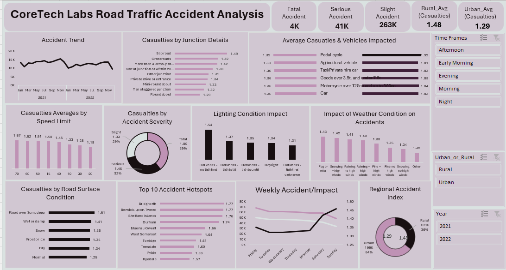

## 👩🏽‍💻 Welcome to My Portfolio

Hi, I’m Susan Dania - a data professional who thrives on transforming raw data into meaningful, strategic insights that drive smarter business decisions 😊.

With hands-on experience in SQL, Excel, Tableau, Python and data cleaning, I help businesses uncover trends, track KPIs, and tell compelling data stories. My approach blends curiosity with technical skill — making data not just accurate, but actionable.

# Competencies
- Data Analysis
- SQL, Excel, Tableau, Python
- Data Visualization & Reporting
- Dashboards & Business Intelligence
- Data Cleaning/Wrangling

## 📊 My Projects

**Comprehensive Analysis of Road Traffic Accident using Coretech Dataset**

[Read More]

# Contact Me

🤝 I'm always open to new opportunities, collaborations, or simply connecting with like-minded professionals. Feel free to explore my work and reach out!

- 📍 **Location:** [Vancouver], [Canada]
- ✉️ **Email:** [susan.dania@outlook.com](susan.dania@outlook.com)
- 💼 **LinkedIn:** [www.linkedin.com/in/susandania](https://www.linkedin.com/in/susandania)
- 📄 **Resume/CV:** [Download My CV](./assets/docs/SusanDania_CV.pdf)

